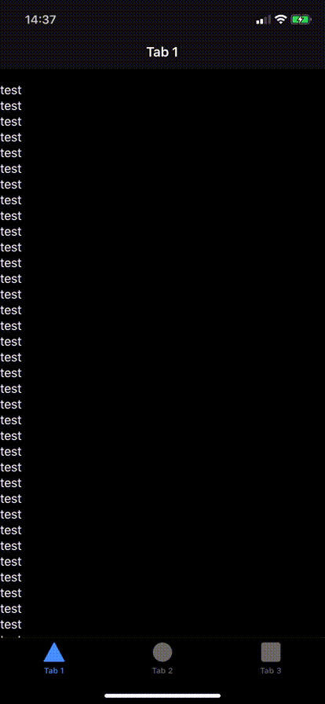

# Ionic starter with ion-refresher ios bug

The [ion-refresher](https://ionicframework.com/docs/api/refresher) does not work properly under iOS. When the refresher is visible and the content is scrolled, the content has a padding top and is not properly resized, which makes some content on the bottom not visible.



## ionic info (project)
```
Ionic:

   Ionic CLI                     : 6.11.0 (/usr/local/lib/node_modules/@ionic/cli)
   Ionic Framework               : @ionic/angular 5.3.2
   @angular-devkit/build-angular : 0.1000.8
   @angular-devkit/schematics    : 10.0.8
   @angular/cli                  : 10.0.8
   @ionic/angular-toolkit        : 2.3.3

Cordova:

   Cordova CLI       : 9.0.3 (cordova-lib@9.0.2)
   Cordova Platforms : ios 5.1.1
   Cordova Plugins   : cordova-plugin-ionic-keyboard 2.2.0, cordova-plugin-ionic-webview 4.2.1, (and 4 other plugins)

Utility:

   cordova-res : 0.15.1
   native-run  : 1.0.0

System:

   Android SDK Tools : 26.1.1 (/Users/.../Library/Android/sdk)
   ios-deploy        : 1.10.0
   ios-sim           : 8.0.2
   NodeJS            : v10.15.3 (/usr/local/bin/node)
   npm               : 6.14.8
   OS                : macOS Catalina
   Xcode             : Xcode 11.6 Build version 11E708
```

[Link to video](readme_resource/bug_ios_11.MP4)